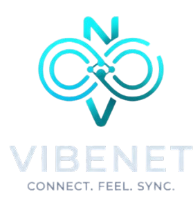

<p align="center">
  
</p>

<h1 align="center">VIBENET</h1>

<p align="center">
  Social Media Platform
</p>

<p align="center">
  <a href="https://vibenetpost.netlify.app/">Live Demo</a>
</p>

---

## 📖 Overview

VIBENET is a full-stack social media platform where users can create accounts, share posts, upload images, like content, and interact through comments in real time. Built using Vanilla JavaScript and Supabase, the application demonstrates secure authentication, media storage, and complete CRUD functionality with a responsive user interface.

---

## ✨ Features

- Secure user authentication
- Create, edit, and delete posts
- Upload post images
- Like system
- Comment system
- Responsive design
- Real-time database synchronization
- Protected CRUD permissions
- Modern Bootstrap UI

---

## 🎯 Problem

Traditional static web applications lack real-time social interactions and secure user-generated content management. Users need a platform where they can safely create, share, and engage with content while maintaining ownership of their posts.

---

## 💡 Solution

Developed a full-stack social media application using Supabase Authentication, PostgreSQL, and Storage. Users can securely create accounts, publish posts with images, interact through likes and comments, and manage only their own content using Row Level Security (RLS).

---

## 🚀 Result

Delivered a responsive social platform featuring authentication, media uploads, protected CRUD operations, and real-time social interactions, demonstrating modern Backend-as-a-Service development with Supabase.

---

## 🛠 Tech Stack

- HTML5
- CSS3
- JavaScript (ES6+)
- Bootstrap 5
- Supabase Authentication
- PostgreSQL
- Supabase Storage

---

## 📚 Engineering Insights

- Building a complete CRUD application
- Working with Supabase Authentication
- Managing PostgreSQL data using Supabase
- Implementing Row Level Security (RLS)
- Uploading and managing media with Storage Buckets
- Building responsive interfaces using Bootstrap
- Designing secure user-based permissions

---

## 📂 Folder Structure

```text
VIBENET/
│
├── assets/
│   ├── logo.png
│   └── logoicon.png
│
├── css/
│   └── style.css
│
├── js/
│   ├── auth.js
│   ├── app.js
│   └── config.js
│
├── index.html
├── README.md
```

---

## ⚙️ Installation

Clone the repository

```bash
git clone https://github.com/maheenfarooqui/Vibe-Net
```

Go to the project directory

```bash
cd Post-App
```

Install project dependencies (if applicable)

```bash
npm install
```

Configure Supabase

- Create a new Supabase project
- Create the required database tables
- Create a public Storage Bucket named **images**
- Enable Row Level Security (RLS)
- Add your project URL and Anon Key inside `js/config.js`

Run the project locally

Using VS Code Live Server

```text
Right-click index.html → Open with Live Server
```

Or

```bash
npx http-server
```

---

## 🔒 Security

Supabase Row Level Security (RLS) is used to protect user data.

- Authenticated users can read posts, likes, and comments.
- Users can create content only after authentication.
- Users can update or delete only their own posts.
- Media uploads are securely managed through Supabase Storage.

---

## 🌐 Live Demo

https://vibenetpost.netlify.app/

---

## 👩‍💻 Author

**Maheen Zuhra**

Frontend Developer

- Portfolio: https://maheen-zuhra-portfolio.vercel.app/
- LinkedIn: https://www.linkedin.com/in/maheen-zuhra/
